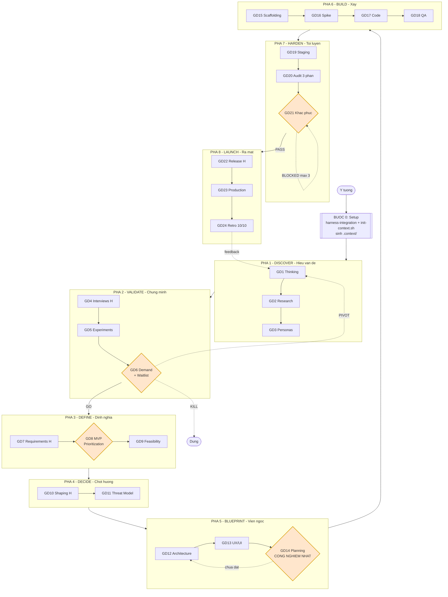
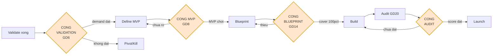
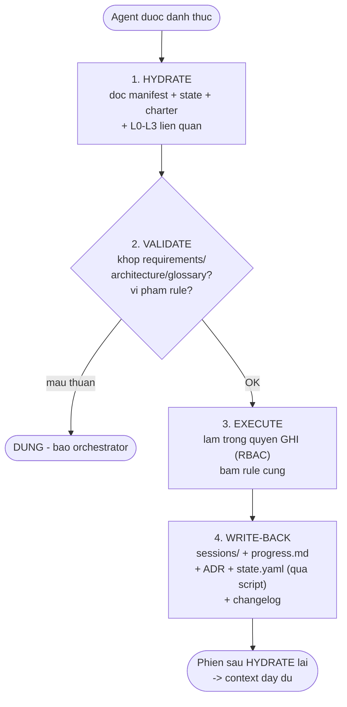
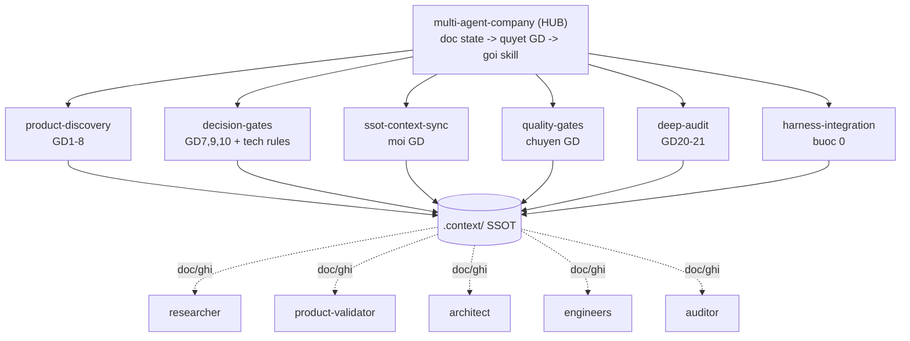

# Workflow — Multi-Agent Company (24 giai đoạn)

> Sơ đồ trực quan cách hệ thống vận hành. GitHub render Mermaid trực tiếp.

---

## 1. Toàn cảnh: 8 pha × 3 giai đoạn



H = human-checkpoint (GD4, 7, 10, 22) · {} = cong chan (GD6, 8, 14, 21)

---

## 2. Bon cong chan song con



| Cong | Chan gi | Y nghia |
|------|---------|---------|
| **Validation (GD6)** | Khong co nhu cau that -> khong code | Chong "build cai khong ai can" |
| **MVP (GD8)** | Chua chot MVP -> khong thiet ke | Chong "build moi thu cung luc" |
| **Blueprint (GD14)** | Thiet ke chua chat -> khong code | Chong "code tren nen lung lay" |
| **Audit (GD20-21)** | Chua dat diem -> khong ra mat | Chong "ship hang loi" |

---

## 3. Vong doi 1 agent trong 1 phien (Hydrate -> Write-back)



---

## 4. Cach 7 skill phoi hop



> Agent KHONG noi chuyen truc tiep. Moi giao tiep qua artifact trong .context/.

---

## 5. Chay thuc te (CLI dieu khien)

Dung `run.sh` de biet "gio phai lam gi":

```bash
# Khoi tao du an
bash run.sh init ./my-project "Ten du an" small saas

# Xem trang thai hien tai + gate + lenh tiep theo
bash run.sh status ./my-project

# Qua cong giai doan hien tai -> sang giai doan ke
bash run.sh advance ./my-project

# Ghi quyet dinh cong validation (GD6)
bash run.sh validate ./my-project go      # hoac pivot / kill

# Xem checklist gate cua giai doan hien tai
bash run.sh gate ./my-project
```

Xem chi tiet: `multi-agent-company/SKILL.md` (HUB) + `multi-agent-company/references/pipeline.md`.
